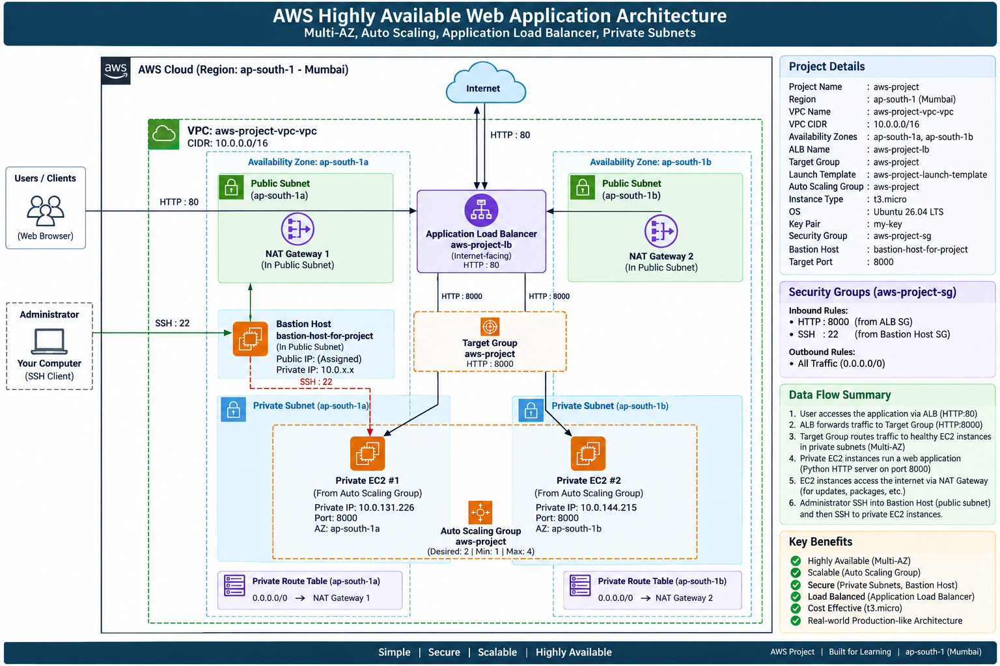

# AWS Highly Available Web Application

> **Multi-AZ AWS Architecture using VPC, Private EC2, Auto Scaling, Application Load Balancer, Target Groups, NAT Gateway and Bastion Host**

---

## 📌 Project Overview

This project demonstrates how to deploy a highly available web application on AWS using a Multi-AZ architecture.

The application servers are deployed on **EC2 instances inside private subnets** across two Availability Zones.

Users access the application through an **Internet-facing Application Load Balancer (ALB)**.

The ALB forwards incoming HTTP requests to healthy EC2 instances through a **Target Group**.

An **Auto Scaling Group** manages the EC2 application servers.

A **Bastion Host** is used to securely connect to the private EC2 instances through SSH.

---

# 🏗️ Architecture

### High-Level Architecture

🎯 Project Objective

The main objective of this project is to understand how AWS networking and compute services work together to create a highly available application.

The architecture demonstrates:

VPC networking
Public and private subnets
Multi-AZ deployment
Internet Gateway
NAT Gateway
EC2
Launch Template
Auto Scaling Group
Bastion Host
Application Load Balancer
Target Group
Health Checks
Security Groups
SSH connectivity
HTTP traffic
High availability
☁️ AWS Region
AWS Region:
ap-south-1

Region:
Mumbai
📋 Project Resources
Resource	Name / Configuration
VPC	aws-project-vpc-vpc
VPC CIDR	10.0.0.0/16
Region	ap-south-1
Availability Zones	ap-south-1a, ap-south-1b
Public Subnets	2
Private Subnets	2
NAT Gateways	2
VPC Endpoint	S3 Gateway
Launch Template	aws-project-launch-template
Auto Scaling Group	aws-project
Instance Type	t3.micro
OS	Ubuntu 26.04 LTS
Key Pair	my-key
Security Group	aws-project-sg
Bastion Host	bastion-host-for-project
Target Group	aws-project
Target Port	8000
Load Balancer	aws-project-lb
Listener	HTTP : 80

1️⃣ Create the VPC

The first step was creating the AWS VPC.

Go to:

AWS Console → VPC → Your VPCs → Create VPC

Select:

Resources to create:
VPC and more

Configure:

Name:
aws-project-vpc

IPv4 CIDR:
10.0.0.0/16

IPv6:
No IPv6 CIDR block

Tenancy:
Default

Availability Zones:
2

Public subnets:
2

Private subnets:
2

NAT gateways:
1 per AZ

VPC endpoint:
S3 Gateway
VPC Architecture
VPC
10.0.0.0/16
|
+-----------------------------+
|                             |
| AZ: ap-south-1a             |
|                             |
|  +-----------------------+  |
|  | Public Subnet         |  |
|  +-----------------------+  |
|                             |
|  +-----------------------+  |
|  | Private Subnet        |  |
|  +-----------------------+  |
|                             |
+-----------------------------+

+-----------------------------+
|                             |
| AZ: ap-south-1b             |
|                             |
|  +-----------------------+  |
|  | Public Subnet         |  |
|  +-----------------------+  |
|                             |
|  +-----------------------+  |
|  | Private Subnet        |  |
|  +-----------------------+  |
|                             |
+-----------------------------+

  

2️⃣ Verify VPC Networking

After creating the VPC, verify the following components:

VPC
Internet Gateway
Public Subnets
Private Subnets
Route Tables
NAT Gateways
Public Route
0.0.0.0/0
     |
     v
Internet Gateway
Private Route
0.0.0.0/0
     |
     v
NAT Gateway

3️⃣ Create the Security Group

Create the security group:

aws-project-sg

The security group is used for the application infrastructure.

Application traffic:

TCP
Port: 8000

SSH:

TCP
Port: 22

For a production environment, security groups should be separated so that the ALB can access port 8000 and only the Bastion Host can access SSH on port 22.

4️⃣ Create the Launch Template

Go to:

EC2 → Launch Templates → Create launch template

Configure:

Launch Template Name:
aws-project-launch-template

AMI:
Ubuntu 26.04 LTS

Instance Type:
t3.micro

Key Pair:
my-key

VPC:
aws-project-vpc-vpc

Security Group:
aws-project-sg

The application will run on:

Port:
8000

5️⃣ Create the Auto Scaling Group

Go to:

EC2 → Auto Scaling Groups → Create Auto Scaling Group

Configure:

Auto Scaling Group Name:
aws-project

Launch Template:
aws-project-launch-template

VPC:
aws-project-vpc-vpc

Select the private subnets:

Private Subnet - ap-south-1a

Private Subnet - ap-south-1b

Capacity:

Desired Capacity:
2

Minimum Capacity:
1

Maximum Capacity:
4

The Auto Scaling Group distributes the application instances across the Availability Zones.

6️⃣ Verify Private EC2 Instances

The Auto Scaling Group launches the application servers.

Private EC2 #1
Server:
Private EC2 #1

Availability Zone:
ap-south-1a

Private IP:
10.0.131.226
Private EC2 #2
Server:
Private EC2 #2

Availability Zone:
ap-south-1b

Private IP:
10.0.144.215

Both instances are inside private subnets.

They do not have public IP addresses.

7️⃣ Install Application on Private EC2 #1

Connect to Private EC2 #1 through the Bastion Host.

Create:

index.html

HTML:

<!DOCTYPE html>
<html lang="en">
<head>
    <meta charset="UTF-8">
    <meta name="viewport" content="width=device-width, initial-scale=1.0">
    <title>AWS Project - Server 1</title>
</head>

<body>

    <h1>AWS Highly Available Web Application</h1>

    <h2>Server 1</h2>

    
This response is coming from:

    <ul>
        <li>EC2 Server: Private EC2 #1</li>
        <li>Availability Zone: ap-south-1a</li>
        <li>Private IP: 10.0.131.226</li>
    </ul>

    

        This server is running inside a private subnet
        behind an Application Load Balancer.
    

</body>
</html>

Start the application:

python3 -m http.server 8000

Expected:

Serving HTTP on 0.0.0.0 port 8000

8️⃣ Install Application on Private EC2 #2

Create:

index.html

HTML:

<!DOCTYPE html>
<html lang="en">
<head>
    <meta charset="UTF-8">
    <meta name="viewport" content="width=device-width, initial-scale=1.0">
    <title>AWS Project - Server 2</title>
</head>

<body>

    <h1>AWS Highly Available Web Application</h1>

    <h2>Server 2</h2>

    
This response is coming from:

    <ul>
        <li>EC2 Server: Private EC2 #2</li>
        <li>Availability Zone: ap-south-1b</li>
        <li>Private IP: 10.0.144.215</li>
    </ul>

    

        This server is running inside a private subnet
        behind an Application Load Balancer.
    

</body>
</html>

Start:

python3 -m http.server 8000

9️⃣ Create the Bastion Host

The private EC2 instances do not have public IP addresses.

Therefore, we use a Bastion Host for SSH access.

Create an EC2 instance:

Name:
bastion-host-for-project

AMI:
Ubuntu 26.04 LTS

Instance Type:
t3.micro

Key Pair:
my-key

VPC:
aws-project-vpc-vpc

Subnet:
Public Subnet - ap-south-1a

The Bastion Host receives a public IP address.

Purpose
Administrator Laptop
        |
        | SSH
        v
Bastion Host
        |
        | SSH
        v
Private EC2

🔟 Copy PEM Key to Bastion Host

The PEM key exists on the Windows machine:

C:\Users\Zarthi\Downloads\my-key.pem

Git Bash uses:

/c/Users/Zarthi/Downloads/my-key.pem

Run:

scp -i /c/Users/Zarthi/Downloads/my-key.pem \
/c/Users/Zarthi/Downloads/my-key.pem \
ubuntu@<BASTION_PUBLIC_IP>:/home/ubuntu/

Then connect:

ssh -i /c/Users/Zarthi/Downloads/my-key.pem ubuntu@<BASTION_PUBLIC_IP>

Verify:

ls

Expected:

my-key.pem

Set the correct permissions:

chmod 400 my-key.pem

